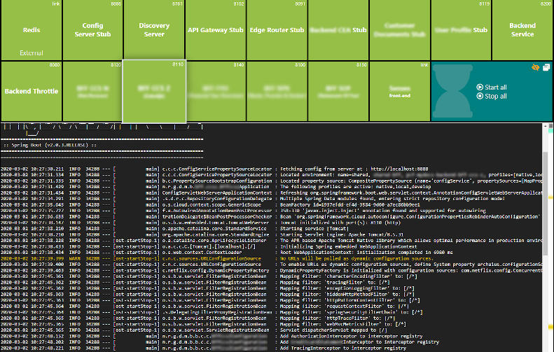
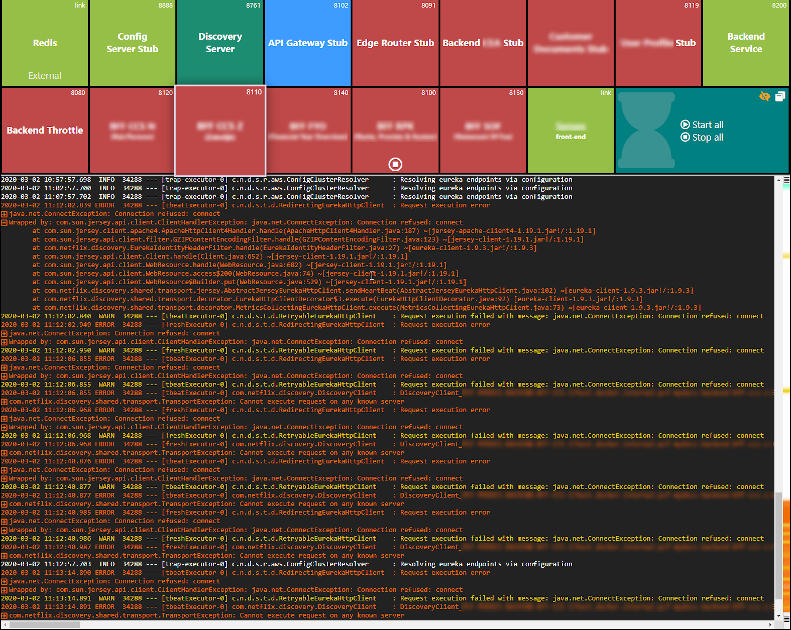

# DevLogDashboard



## What is it
A dashboard that shows log output and service state, typically when in a development environment.

The dashboard shows a configured list of services. These services can be:
 - Started by the server itself. The process output then is analyzed to determine the state.
 - External connection, tested to be alive. Can be configured to act as watchdog.
 - Logfile. The contents of a logfile (which may be appended to) will be shown as output.

See the built in [services.yaml](src/main/resources/services.yaml) file for service configuration options.

To change the service configuration, copy the services.yaml to the directory the jar runs from
(or --root dir). That file will be used when available instead of
the internal one. The server will update itself when it detects any change in the configuration.


## Why was it created
I created this application in my spare-time while on an assignment in 2018 where a team of
developers used it (and may still use it) to handle running a few dozen micro-services at
development time. Since then I also used it on assignments in other companies. So it seems this
functionality is helpful in multiple environments. Therefore I made it available on github.

## How to run
You can build it yourself (check out this repository and do a `mvn clean install`) or download
the newest version from [rutilo.nl/dashboard.jar](https://www.rutilo.nl/dld/dev-log-dashboard.jar) (my personal site). When a
new version is available the dashboard will provide an option to update with a single click.
Updates are done by downloading a small patch file (created by [ZipDiff](https://github.com/nicolasdejong/ZipDiff))
from the same location.

There are a few command-line options that can (but generally don't need to) be used.

```
Possible JVM options:
-Dserver.port=<port>  Server port (default is 8099 or from services.yaml, 0 for random)
-Droot=<dir>          Where to load jars from (default is current directory)
-DpropFile=<file>     yaml file (default is services.yaml in local dir, then inner)
-Dnotray              Don't add a tray icon

Possible options:
--root[=]<dir>        Where to load jars or run commands from (default is current directory)
--server.port=<port>  Server port (default is 8099 or from services.yaml, 0 for random)
--notray              Don't add a tray icon
--noautostart         Ignore the 'start' keys of the services configuration
--startall            Act as if all services have the 'start: true' configuration
--config[=]<path>     Location where the load the configuration. When a directory path
                      is provided, 'services.yaml' will be appended.
```
